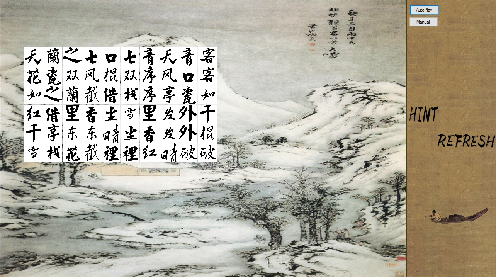

# Shanghai-Game

Draw a line with at most two corners, to remove all the tiles from the board by matching pairs.

Executable File Download: [Google Drive](https://drive.google.com/drive/folders/1rNtwowmOayAB1g8jt4ujIZILSNt7wHTG?usp=sharing)

## Known Issues

- Duplicated image resources in the "material" folder. Consider using image overlay to reduce the size of this folder.